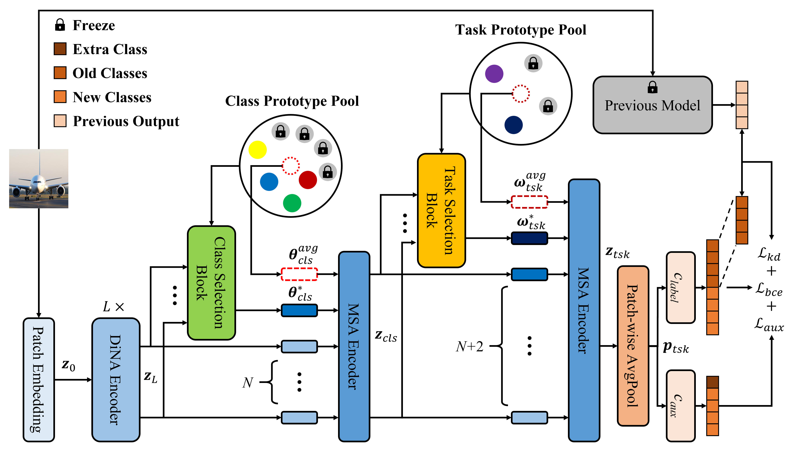

# DPFormer: Dynamic Prompt Transformer for Continual Learning

**Sheng-Kai Huang**, 
**Jiun-Feng Chang**, 
**[Chun-Rong Huang](http://cvml.cs.nycu.edu.tw/biography.html)**

[Paper](https://arxiv.org/abs/2506.07414)
|
[arXiv](https://arxiv.org/abs/2506.07414)
|
[BibTeX](#citation)

---
Welcome to DPFormer Official PyTorch implementation!
<p align="center">
    
</p>

---

## Installation

Create a conda environment.

```bash
conda create -n dpf python=3.10 -y
conda activate dpf
```

Install PyTorch 1.12.0 (CUDA 11.3).

```bash
pip install torch==1.12.0+cu113 torchvision==0.13.0+cu113 torchaudio==0.12.0+cu113 \
    --extra-index-url https://download.pytorch.org/whl/cu113
```

Install the remaining dependencies.

```bash
pip install -r requirements.txt
```

If you train the DiNAT backbone from scratch, install NATTEN.

```bash
pip install natten==0.14.6 \
    -f https://shi-labs.com/natten/wheels/cu113/torch1.12/index.html
```

---

## Datasets

- **CIFAR-100:** downloaded automatically to `datasets/cifar100` on first run.
- **ImageNet-R:** place under `datasets/imagenet-r/{train,val}` (ImageFolder layout).

Class orders live in `options/data/` (e.g. `imagenet100_order1`, `cifar100_order3.yaml`).

---

## Training

Launch via `train.sh` (wraps `torchrun`). First argument is the GPU list; the rest are
forwarded to `main.py`.

```bash
# CIFAR-100, from scratch, increment=2 (50 tasks), order3
bash train.sh 0,1 \
  --name my_run \
  --increment 2 \
  --options options/data/cifar100_order3.yaml options/config.yaml \
  --oversample_old 3
```

```bash
# CIFAR-100 with a pretrained ViT backbone (input_size is forced to 224)
bash train.sh 0,1 \
  --name my_pretrained_run \
  --increment 10 \
  --pretrained_model google/vit-base-patch16-224 \
  --options options/data/cifar100_order1.yaml options/config.yaml
```
---

## Evaluation

```bash
python test.py --ckpt_dir ./checkpoints/cifar100/10/<date>/<exp> --increment 10
```
---
## Experimental Results
| Dataset | Setting | Avg. Acc. | Last Acc. |
|---------|----------|---------------|---------------|
| CIFAR-100 | 10 steps | 78.14 | 69.57 |
| CIFAR-100 | 20 steps | 76.34 | 65.62 |
| CIFAR-100 | 50 steps | 74.68 | 61.14 |
| ImageNet100 | 10 steps | 81.54 | 72.48 |
| ImageNet1K | 10 steps | 76.13 | 66.08 |

---

## Model Weights

| Model | Dataset | Download |
|--------|----------|----------|
| DPFormer | CIFAR100-10steps | Coming Soon |
| DPFormer | CIFAR100-20steps | Coming Soon |
| DPFormer | CIFAR100-50steps | Coming Soon |
| DPFormer | ImageNet100 | Coming Soon |
| DPFormer | ImageNet1K | Coming Soon |

---

## Citation

If you find this repository useful, please consider citing our paper.

```bibtex
@article{huang2025dpformer,
    title={DPFormer: Dynamic Prompt Transformer for Continual Learning},
    author={Sheng-Kai Huang and Jiun-Feng Chang and Chun-Rong Huang},
    journal={arXiv preprint arXiv:2506.07414},
    year={2025}
}
```
